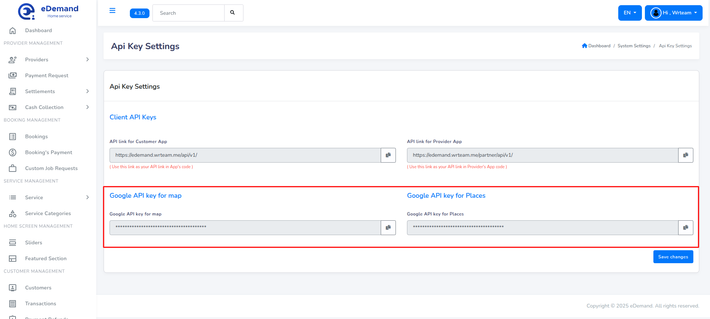

# Configure eDemand

:::note

In order to Configure eDemand you must have Admin Account.

:::

## Use the given guide to configure and customize eDemand as you need.

Login as admin by

1. Enter Admin Login id and Password. Click Login
   

2. Great! You have logged in as Admin.
   

#### Follow the steps given below to customize eDemand.

## General Settings

All the General Settings like Company Title, Support Name, Support Email, favicon, Half Logo, Currency Symbol, TimeZone, Phone, Site Colors, Address, Description, Copyright Details, And Support Hours. Just go to Settings -> General.

## Google Map Api Keys

:::note
You need to enable the billing to make work of map on admin panel. If its not dispalying the map thn you had miss some step on google console so please do proper setup for key.
:::

:::note
If map is not dispalying then it is your responsibiliy to do proper things.
:::

:::note
Installation and map setup is out of the scope.Please note it down.
:::

1. First step is to go to google developer console and follow this offical documentation of google.

2. While following this Offical Documentation there you need to enable API You need to enable [Javascript API](https://developers.google.com/maps/documentation/javascript/cloud-setup)

these API : [Offical Documentation for creating API key](https://developers.google.com/maps/documentation/maps-static/get-api-key#restrict_key)

3. Usage of Google Map API Key:

   1. While adding or registering the partner we need to add location from map.

4. Now, we need to restrict the APIs key for security purpose.For that you need to folow this official documentation from google [Restrict Key](https://developers.google.com/maps/documentation/maps-static/get-api-key#restrict_key)

:::note

After creating the GOOGLE API KEY for map and other work.Please do Restriction on that APi key by following the documentation provided by google.

:::

1. Visit this documentation for enable or disable the APIs [Enable or Disable APIs](https://support.google.com/googleapi/answer/6158841?hl=en) 2. Visit this documentation for API Restricting for security. [Restrict Key](https://developers.google.com/maps/documentation/maps-static/get-api-key#restrict_key) 3. Then, Set created API KEY on System -> General Settings -> Google Map API KEY

## Email Settings

Configure Email settings. Just go to Settings -> SMTP (Email).

1. Type the host name.
2. Type SMTP user name.
3. Type SMTP Password.
4. Enter SMTP Port no.
5. Select SMTP Encryption Type
6. Select Mail type (HTML,TEXT)

## Terms And Conditions

Configure Terms And Conditions settings. Just go to Settings -> Terms and Conditions.

1. Enter all Terms and conditions under Terms and conditions section.

   

## Privacy Policy

Configure Privacy Policy settings. Just go to Settings -> Privacy Policy.

1. Enter all Privacy Policy under Privacy Policy section.

   

## Language Settings

You can manage languages for the system from admin panel for apps, web, and panel. To do this go to Settings -> Language Setting

Note: code for the language must be two-letter code and all small letters. Ensure all files for each is uploaded to ensure it works in app, and web

    
