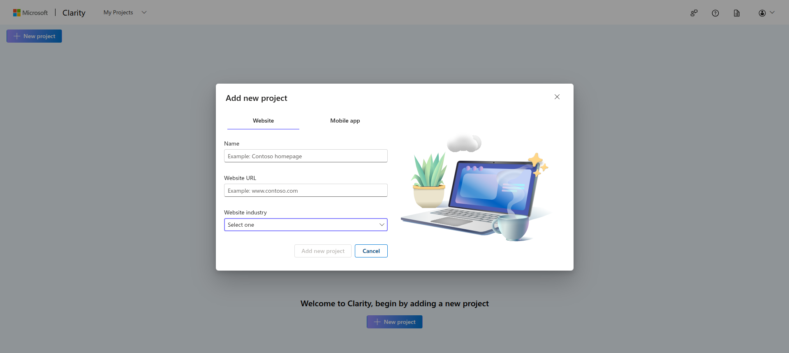
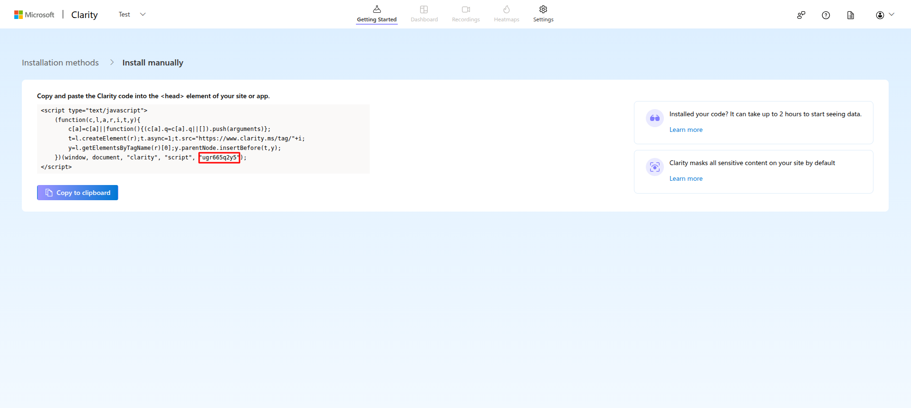

# Microsoft Clarity

    Go to mircosoft clarity projects and create a new project. Select website, add your admin panel URL, and other details. 
    

    In the Install manual card, click on "Get tracking code" to get the project ID to set in admin panel. The ID needed is as shown in the image.
    

    Copy the above ID and paste it in the admin panel API key settings menu and toggle the enable button to start tracking. For this go to "system settings -> API key settings"
    