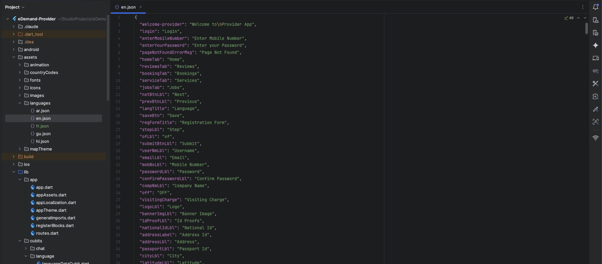

# How to Manage Languages

Language management allows you to add, edit, or remove languages and customize translation strings in your app. All language operations are now handled through the admin panel.

---

## Language Management

:::tip  
Get Your Language Codes → [Get language codes](https://developers.google.com/admin-sdk/directory/v1/languages)
:::

### Add a New Language

Language management is now handled through the admin panel. Follow these simple steps:

#### Step 1: Access Language Settings
1. **Login to Admin Panel**: Go to your admin panel dashboard
2. **Navigate to Languages**: Click on **System Settings > Language Settings**

#### Step 2: Fill Language Details
In the "Add" section, complete the following fields:

1. **Language Name**: Enter the full name (e.g., "Spanish", "French", "German")
2. **Language Code**: Enter the 2-letter code (e.g., "es", "fr", "de")
3. **RTL Support**: Toggle "Is RTL" if the language reads right-to-left (like Arabic, Hebrew)
4. **Language Flag**: Upload a flag image for the language

#### Step 3: Upload Translation Files
Upload the translation files for each platform:

1. **Panel**: Upload admin panel translation file
2. **Web**: Upload website translation file  
3. **Customer App**: Upload customer app translation file
4. **Provider App**: Upload provider app translation file

:::tip
You can download sample files first to understand the format, then create your own translation files.
:::

#### Step 4: Submit
Click the **Submit** button to add the new language.

#### Step 5: Set as Default (Optional)
From the language list below, you can set any language as the default:

1. Find your language in the table
2. Click **"Set as Default"** button in the Default column
3. The language will be marked with ✓ Default

---

## Edit or Remove Language

You can edit or remove existing languages directly from the admin panel:

1. Go to **System Settings > Language Settings**
2. In the language list, find the language you want to modify
3. Click the **Edit** button to update language details or translation files
4. Click the **Delete** button to remove a language

:::caution  
When updating translations, **only change the text on the right side (the value)** and do **not** modify the text on the left side (the key).

✅ **Correct way to update:**

<pre>
"welcome_message": "Hello, Welcome!"
</pre>

❌ **Incorrect way (Do NOT change the key):**

<pre>
"welcome_message_updated": "Hello, Welcome!"  // ❌ Incorrect!
</pre>

:::

 