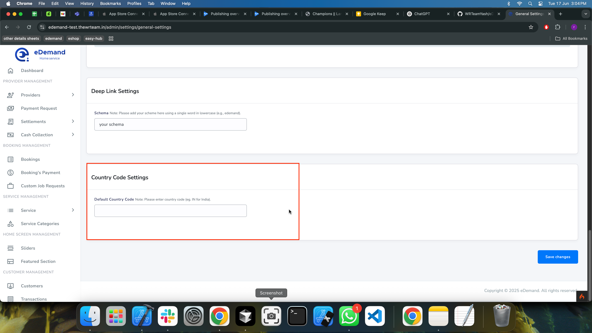
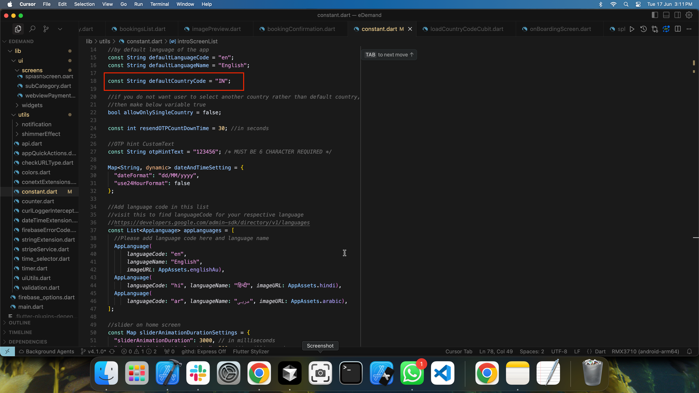

# How to Change Default Country Code

This guide explains how to set and manage the default country code for phone number login in your eDemand application. There are two ways to configure this:

1. Through the Admin Panel (Recommended)
2. Through Code Configuration (Backup)

## 1. Admin Panel Configuration

The easiest way to set the default country code is through the admin panel:

1. Log in to your Admin Panel
2. Navigate to **Settings > General Settings**
3. Find the **Country Code Settings** section
4. Add your desired country code
5. Click **Save** to apply changes


*Figure 1: Country Code Settings in Admin Panel*

:::tip
This is the recommended method as it allows you to change the country code without modifying the code.
:::

## 2. Code-Side Configuration (Backup)

If there are any issues with the API or admin panel settings, the app will fall back to the code-side configuration. This serves as a backup to ensure the app always has a valid country code.

### Location
The default country code is defined in:
```
lib/utils/constant.dart
```

### How to Modify

1. Open `lib/utils/constant.dart`
2. Find the country code constant
3. Update the value to your desired country code


*Figure 2: Default Country Code Configuration in constant.dart*

Example:
```dart
// Default country code constant
const String defaultCountryCode = 'IN'; // Change this to your desired country code
```

:::note
The code-side configuration serves as a fallback. The admin panel settings will take precedence when available.
:::

## Best Practices

1. **Always set through Admin Panel first**
   - This is the recommended approach
   - Changes can be made without code deployment
   - Easier to manage and update

2. **Keep code-side configuration as backup**
   - Ensures app functionality even if API fails
   - Should match your most common user base
   - Update only when absolutely necessary

3. **Testing**
   - After changing the country code, test the login flow
   - Verify both admin panel and code-side configurations
   - Check if the changes reflect correctly in the app

## Troubleshooting

If you encounter issues with country code settings:

1. Check if the admin panel settings are saved correctly
2. Verify the API is responding with the correct country code
3. If issues persist, the app will fall back to the code-side configuration
4. Clear app cache and restart if changes don't reflect immediately
