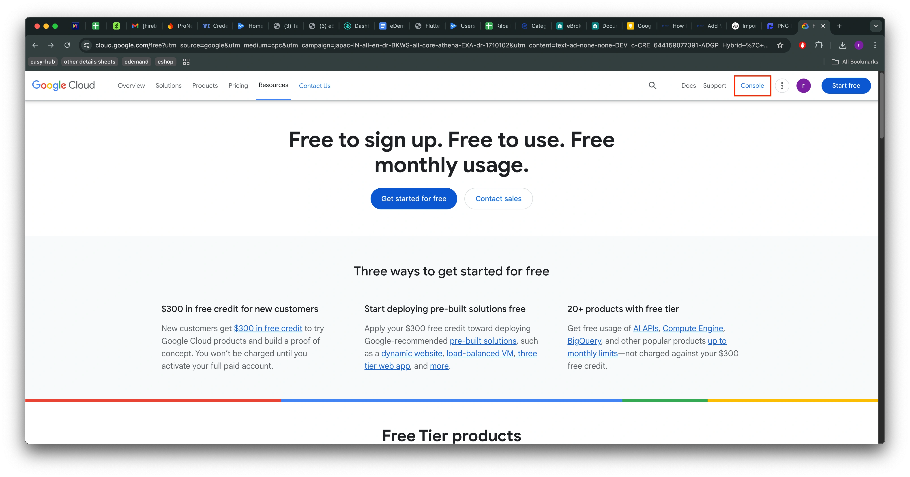
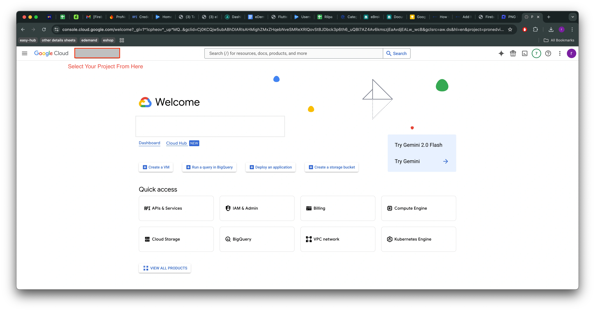
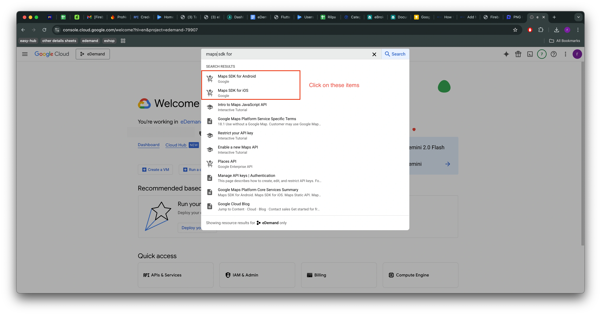
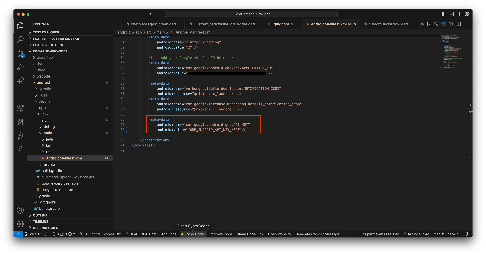
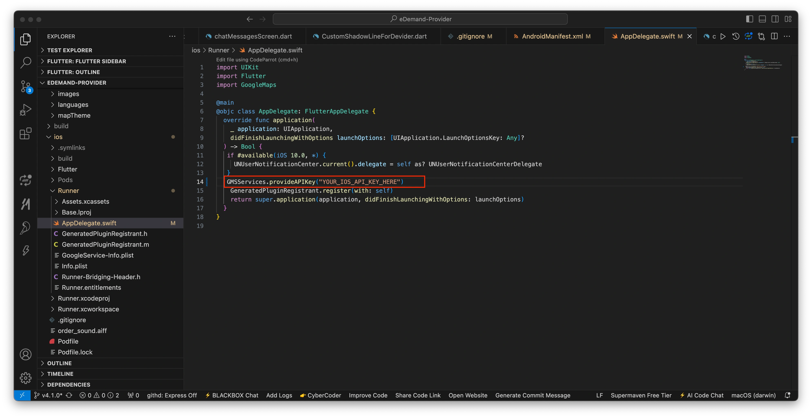

# Add Map API key
<!-- How to Add Map API key -->

# 🗺️ Adding Google Maps API Key to Your Flutter App  

This guide explains how to **generate and add a Google Maps API Key** for both **Android** and **iOS** platforms in a Flutter project.  

---

## 🌍 **Step 1: Enable Required APIs on Google Cloud Console**  

1️⃣ Go to the [Google Cloud Platform](https://console.cloud.google.com/).  
2️⃣ Click on **Console**. 

     

3️⃣ Select your **Firebase Project** (e.g., `eDemand`).  

     

4️⃣ In the search bar, type **APIs & Services** and open it.  

     

5️⃣ Enable the following **APIs one by one**:

 

   - **Maps SDK for Android**  
   - **Maps SDK for iOS**  
   - **Places API** (for autocomplete & location search)  
   - **Geocoding API** (for converting addresses to coordinates)  
   - **Geolocation API** 
   - **Maps Embed API** 

 
---

## 🔑 **Step 2: Get API Keys for Android & iOS**           


1️⃣ Navigate to **APIs & Services > Credentials**.         
2️⃣ Locate your API keys for **Android** and **iOS**.         
3️⃣ Copy them for use in your project.   

 

---

## 🤖 **Step 3: Setup API Key for Android**  

1️⃣ Open your **Flutter project** in your code editor.  
2️⃣ Navigate to:  **android/app/src/main/AndroidManifest.xml**        

3️⃣ Inside the `<application>` tag (before `<activity>`), add the following meta-data:

```xml
<meta-data
    android:name="com.google.android.geo.API_KEY"
    android:value="YOUR_ANDROID_API_KEY_HERE" />
```
 

    :::note
     Replace "YOUR_ANDROID_API_KEY_HERE" with your actual Google Maps API Key.
     :::


## 🍏 Step 4: Setup API Key for iOS

1️⃣ Open the iOS folder in your Flutter project.      
2️⃣ Open:     

```swift
ios/Runner/AppDelegate.swift
```         
3️⃣ In `AppDelegate.swift`, ensure that `GoogleMaps` is imported at the top of the file, but only if it's not already present

```swift
import GoogleMaps
```

4️⃣ Add the following line inside `didFinishLaunchingWithOptions`:

```swift
GMSServices.provideAPIKey("YOUR_IOS_API_KEY_HERE")
```
 

:::note

 Replace "YOUR_IOS_API_KEY_HERE" with your actual Google Maps API Key.
:::


:::caution

 - If the map doesn’t load, check the Google Cloud Console to ensure that the APIs are enabled and the API key has no restrictions.
 - In production, it’s recommended to restrict your API key to your app’s SHA-1 certificate (for Android) and Bundle ID (for iOS).
:::

🎉 **Your Google Maps API Key is now set up and ready to use in your Flutter app!** 🚀