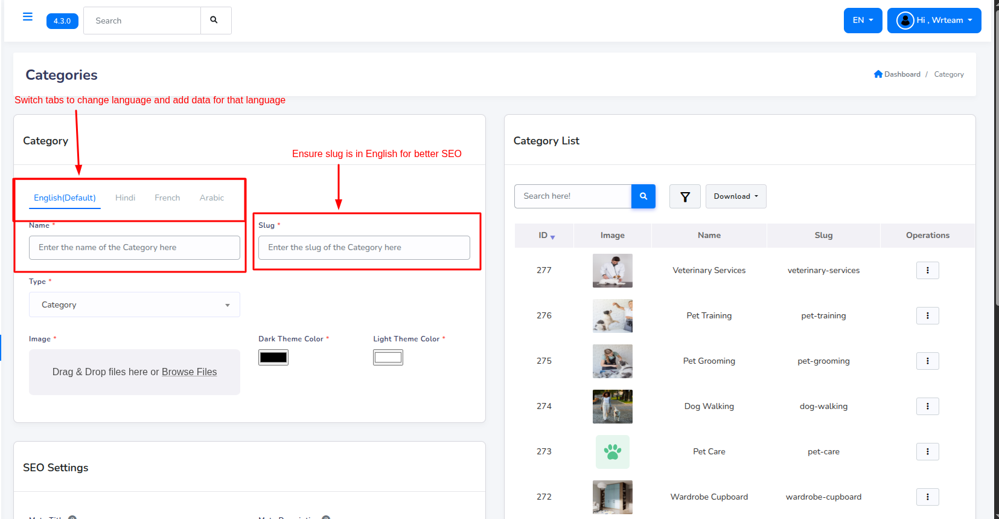

# Multi-Languages

eDemand provides support for multi-language for a more convenient way to use the system.

## Multi-Language data entry

eDemand provides support for entry of multi-language data.

This is example of category, similar data entry can be done for providers, services, faqs, featured sections, sliders, reporting reasons, promocodes, subscription, blogs, and settings like Company settings, about us, terms and conditions, privacy policies, tax, email and sms templates, support details, and web settings
