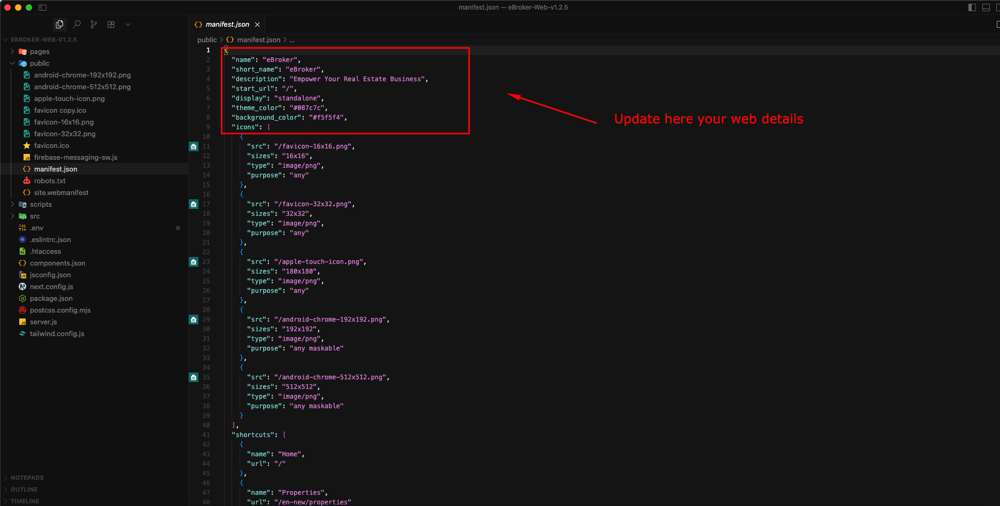
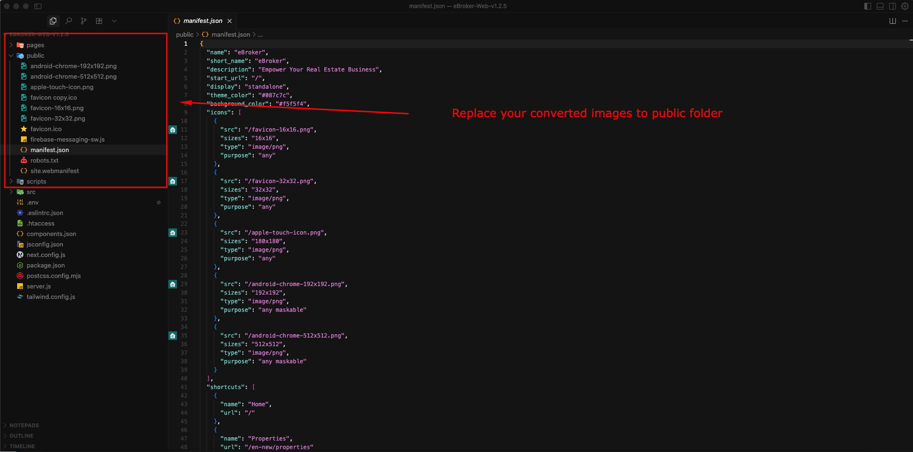

# Progressive Web App (PWA) Setup

<!--
This page explains how to enable and configure PWA features for your eDemand application.
-->

<!-- ## On this page
- [Introduction to PWA](#introduction-to-pwa)
- [Enabling PWA Functionality](#enabling-pwa-functionality)
- [Configuring the Web App Manifest](#configuring-the-web-app-manifest)
- [Setting Up PWA Icons](#setting-up-pwa-icons)
- [Testing Your PWA](#testing-your-pwa)
- [Benefits of PWA for Your eDemand Application](#benefits-of-pwa-for-your-edemand-application) -->

---

## Introduction to PWA

Progressive Web Applications (PWAs) combine the best features of web and mobile apps. They are installable on devices and provide an app-like experience while remaining accessible via web browsers.

Setting up your eDemand application as a PWA enhances user experience by making your service available for installation on devices, providing a more integrated feel with the operating system.

---

## Enabling PWA Functionality

To enable PWA functionality in your eDemand application, you need to modify the `.env` file:

### Step 1: Update the `.env` File

In your `.env` file, locate the line with `NEXT_PUBLIC_PWA_ENABLED` and set its value to `"true"`:

```env
NEXT_PUBLIC_PWA_ENABLED="true"
```

To disable PWA functionality, simply set this value to `"false"`.


---

## Configuring the Web App Manifest

The web app manifest provides information about your application to the browser and controls how your app appears when installed on a user's device.

### Step 2: Update the `manifest.json` File

Navigate to the `public` folder and open the `manifest.json` file. Update the following details to match your application:

- **name**: The full name of your application
- **short_name**: A shorter name for app icons
- **description**: Brief description of your application
- **theme_color**: Primary color theme of your application
- **background_color**: Background color during app loading
- **start_url**: URL that loads when app is launched from home screen
- **display**: Preferred display mode (fullscreen, standalone, minimal-ui, browser)



---

## Setting Up PWA Icons

PWA requires various icon sizes for different devices and contexts. You need to create and place these icons in the `public` directory.

### Step 3: Generate and Replace PWA Icons

You can convert your brand logo into all the required favicon and PWA icon formats using an online tool:

> **Recommended Tool:** [https://favicon.io/favicon-converter/](https://favicon.io/favicon-converter/)
>
> This tool will generate all the necessary icon files from your brand logo.

After generating the icons, replace the following files in your `public` folder with the newly generated ones:

- `android-chrome-192x192.png`
- `android-chrome-512x512.png`
- `apple-touch-icon.png`
- `favicon-16x16.png`
- `favicon-32x32.png`
- `favicon.ico`
- `site.webmanifest` (if provided)

**Important:** Ensure that the file names remain exactly the same as listed above.



---

## Testing Your PWA

After completing the setup, you should test your PWA to ensure everything works correctly:

1. Build and deploy your application
2. Open Chrome DevTools (F12) and navigate to the "Application" tab
3. Under the "Application" panel, check "Manifest" to verify your manifest details are correctly loaded
4. Check "Service Workers" to ensure your service worker is registered and running
5. Use the "Lighthouse" tab to run a PWA audit that will verify all PWA requirements are met

You should see an install prompt on compatible browsers when visiting your site, allowing users to add your application to their home screen.

> **Tip:** To test the installation feature, visit your site on a mobile device or use Chrome's mobile emulation mode, and look for the "Add to Home Screen" option.

---

## Benefits of PWA for Your eDemand Application

- **Installable**: Users can add your app to their home screen without app store requirements
- **Responsive**: Works on any device with a browser
- **App-like Experience**: Provides a seamless, immersive user experience
- **Fresh Content**: Always updated when online
- **Safe**: Served via HTTPS to ensure content hasn't been tampered with
- **Discoverable**: Identifiable as an "application" by search engines
- **Re-engageable**: Can use push notifications to re-engage users
- **Linkable**: Can be shared via URL without requiring installation

> **Note:** While PWAs can provide some caching benefits, the eDemand application requires network connectivity to function properly as it relies on API calls to fetch data.
