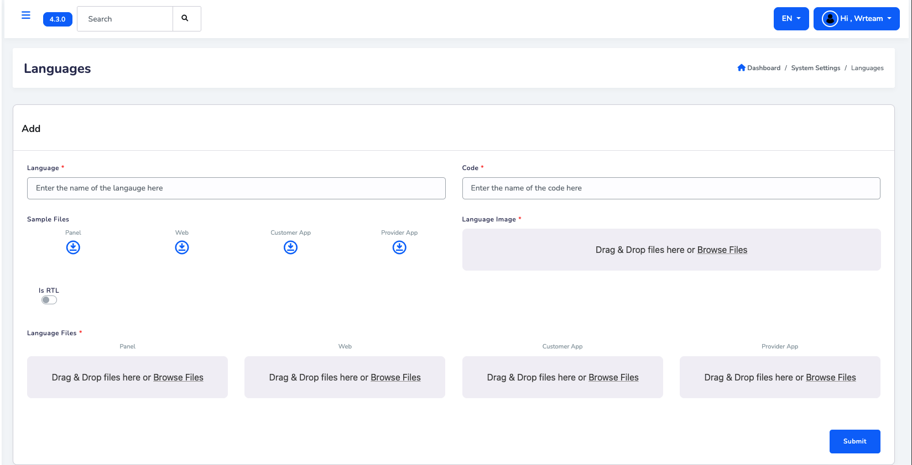
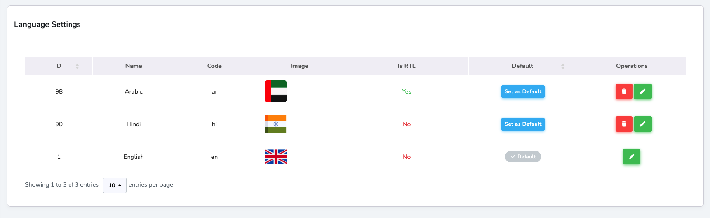

# System Configuration

## Language Configuration

:::tip  
Get Your Language Codes → [Get language codes](https://developers.google.com/admin-sdk/directory/v1/languages)
:::

### Add a New Language

Language management is now handled through the admin panel. Follow these simple steps:

#### Step 1: Access Language Settings
1. **Login to Admin Panel**: Go to your admin panel dashboard
2. **Navigate to Languages**: Click on **System Settings > Language Settings**

#### Step 2: Fill Language Details
In the "Add" section, complete the following fields:

1. **Language Name**: Enter the full name (e.g., "Spanish", "French", "German")
2. **Language Code**: Enter the 2-letter code (e.g., "es", "fr", "de")
3. **RTL Support**: Toggle "Is RTL" if the language reads right-to-left (like Arabic, Hebrew)
4. **Language Flag**: Upload a flag image for the language

#### Step 3: Upload Translation Files
Upload the translation files for each platform:

1. **Panel**: Upload admin panel translation file
2. **Web**: Upload website translation file  
3. **Customer App**: Upload customer app translation file
4. **Provider App**: Upload provider app translation file

:::tip
You can download sample files first to understand the format, then create your own translation files.
:::

#### Step 4: Submit
Click the **Submit** button to add the new language.

#### Step 5: Set as Default (Optional)
From the language list below, you can set any language as the default:

1. Find your language in the table
2. Click **"Set as Default"** button in the Default column
3. The language will be marked with ✓ Default

:::caution  
When updating translations, **only change the text on the right side (the value)** and do **not** modify the text on the left side (the key).

✅ **Correct way to update:**

<pre>
"all_providers": "All Providers"
</pre>

❌ **Incorrect way (Do NOT change the key):**

<pre>
"all_providers_updated": "All Providers"  // ❌ Incorrect!
</pre>

:::

---

## Change theme color

- Go to: **src -> styles -> globals.css**

   

## Change Font style

- Go to: **src -> pages -> app.js**

   